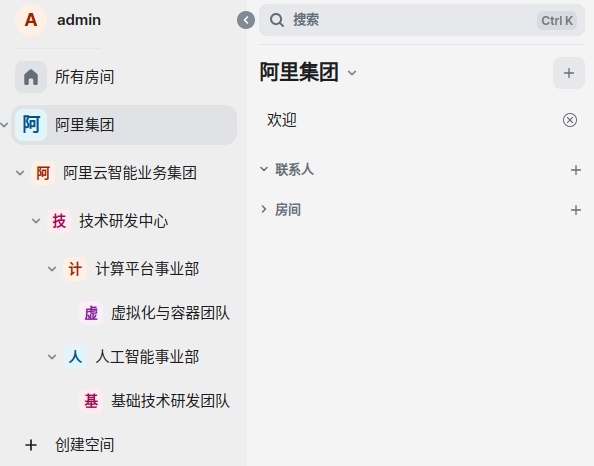
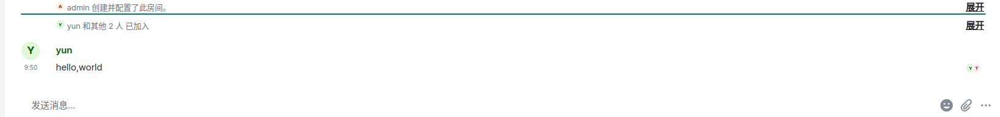

# 一、安装配置
## （一）服务器端
### 1. 系统环境
- 硬件：飞腾D2000
- 操作系统：银河麒麟桌面版V10 SP1
- docker：20.10.7
- IP地址：192.168.213.104

### 2. 软件安装
```bash
$ sudo docker pull matrixdotorg/synapse:latest
$ sudo docker pull vectorim/element-web:latest
```

### 3. 软件设置
1）创建配置文件
```bash
$ sudo docker run -it --rm \
    --mount type=volume,src=synapse-data,dst=/data \
    -e SYNAPSE_SERVER_NAME=im-server \
    -e SYNAPSE_REPORT_STATS=yes \
    matrixdotorg/synapse:latest generate
```
该命令会在/var/lib/docker/volumes/synapse-data/_data中生成名称为homeserver.yaml的配置文件
```bash
# 编辑该文件，加入如下内容
echo "enable_registration: True" >> /var/lib/docker/volumes/synapse-data/_data/homeserver.yaml
echo "enable_registration_without_verification: True" >> /var/lib/docker/volumes/synapse-data/_data/homeserver.yaml
```

2）运行服务
```bash
$ sudo docker run -d --name synapse \
    --mount type=volume,src=synapse-data,dst=/data \
    -p 8008:8008 \
    matrixdotorg/synapse:latest
$ sudo docker run -d --name element -p 80:80 vectorim/element-web:latest
```

## （二）客户端
### 系统环境
- 硬件：Inter X64
- 操作系统：Ubuntu 22.04
- 浏览器：Google Chrome

# 二、运行使用
## 1. 管理员注册
打开浏览器，输入服务器地址：`http://192.168.213.104/`，页面中会提示浏览器不兼容，点击“Continue anyway”即可。


将界面文字改为“简体中文”，点击“创建账户”按钮。


点击“编辑”按钮，将托管服务器地址改为`http://192.168.213.104:8008`，点击“继续”按钮。


输入管理员的用户名和密码，点击“注册”按钮，管理员用户名可自定义，通常设置为admin。


## 2. 创建层次化的组织结构
element中用“空间”指代某一层次的组织，空间可以多层嵌套。在本示例中，我们将创建如下的组织架构：
```
阿里集团
  - 阿里云智能业务集团
    - 技术研发中心
        - 计算平台事业部
            - 虚拟化如容器团队
        - 人工智能事业部
            - 基础技术研发团队
```

在主页面最左侧的工具栏中点击“+”号，选择“创建空间”，点击“公共”按钮。


输入“名称”和"地址"，点击“创建”按钮，地址必须全局唯一，通常设置为名称对应的英文。


在当前层级的空间中点击“添加空间”按钮，创建下一层级的空间。


输入下一层级的“名称”和"地址"，点击“创建”按钮。


所有层级的空间创建完成，如下图所示。


## 3. 创建公共频道
element中用“房间”指代收发消息的频道，首先在最顶层的空间中点击“新建房间”按钮，创建公共频道。


输入“名称”和"房间地址"，点击“创建房间”按钮。


在每一个最原子的空间中（本示例为虚拟化与容器团队、基础技术研发团队），点击“添加现有的房间”按钮。


选择“通知通告”公共房间，点击“添加”按钮，这样管理员在“通知通告”发送消息，所有用户都能收到。


## 4. 创建普通用户
与管理员注册的步骤类似，创建普通用户，本示例中创建了yun和fei两个用户。

## 5. 将用户加入组织
在最顶层的空间中点击“邀请”按钮。


点击“邀请人们”按钮。


输入要邀请的用户名，点击“邀请”按钮。


打开一个新的浏览器无痕窗口，以yun用户身份登录，接受邀请。

## 6. 将用户加入指定层级
在yun用户的主页面中，在“通知通告”公共房间上点击“加入”按钮，该用户会递归地加入到该房间所在的所有上层空间，而不会加入“人工智能事业部”这个平行的层级。


## 7. 全体通告
在“通知通告”公共房间中，点击最下方工具栏中“附件”按钮，选择要发送的文件。


其它用户可收到该文件并下载。


## 8. 群聊
在左侧的组织层级中，选择想要创建群聊的空间，点击“...”按钮，在弹出的菜单中选择“+ 房间”菜单，新创建的房间只有本层及下层的用户可见，可以进行局部范围的群聊和文件发送。


# 三、组件开发
第二项需求也有解决方案。element支持扩展方式，可以开发自己的组件(widget)，实现自定义的功能，NeoBoard这个组件就实现了协同标绘的功能。

https://github.com/matrix-org/matrix-widget-api提供了api接口手册，https://github.com/nordeck/matrix-widget-toolkit提供了在其之上的封装好的sdk。

开发一个docx文档的预览组件，可以参考：mammoth.js。